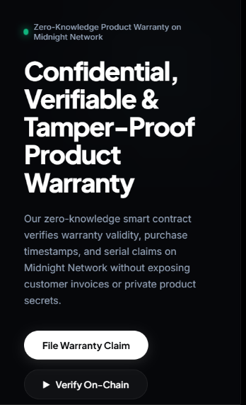
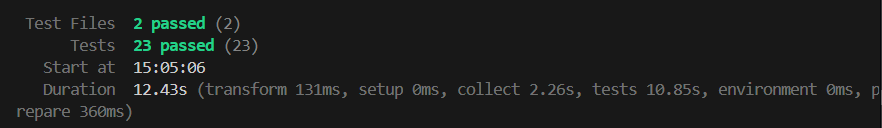

# Confidential Product Warranty Verification (CPWV)
> A privacy-preserving zero-knowledge product authentication & warranty claim dApp built on the Midnight Network using Compact smart contracts and Midnight.js SDK.

[](https://github.com/shuvamdutta2004/confidential-product-warranty-verification)
[](https://youtu.be/7mr0W-CHCbM)
[](https://confidential-product-warranty-verif-hazel.vercel.app/)
[](https://github.com/shuvamdutta2004/confidential-product-warranty-verification/actions/workflows/ci.yml)
[](https://preview.midnightexplorer.com/contracts/0x39764195d14758b6bd52ab6e13a0547bd29e972be5bfa4c18f2ceafc504ddc1a)
[](https://midnight.network)
[](https://midnight.network)
[](https://nextjs.org)
[](https://nodejs.org)
[](https://vitest.dev)
[](LICENSE)

---

## Table of Contents
1. [What Is CPWV?](#what-is-cpwv)
2. [Level 2 & Level 3 Review Compliance](#level-2--level-3-review-compliance)
3. [Live Demo Video & Deployments](#live-demo-video--deployments)
4. [Platform Screenshots](#platform-screenshots)
5. [Smart Contract Architecture (6 Circuits)](#smart-contract-architecture-6-circuits)
6. [Zero-Knowledge Privacy Model](#zero-knowledge-privacy-model)
7. [Frontend & 3D WebGL Architecture](#frontend--3d-webgl-architecture)
8. [Complete Step-by-Step Setup Guide](#complete-step-by-step-setup-guide)
9. [Smart Contract & DApp Integration Flow](#smart-contract--dapp-integration-flow)
10. [Automated Test Suites (Vitest)](#automated-test-suites-vitest)
11. [Troubleshooting & FAQ](#troubleshooting--faq)
12. [Project Verification Checklist](#project-verification-checklist)

---

## What Is CPWV?

**Confidential Product Warranty Verification (CPWV)** is a privacy-preserving smart contract protocol and consumer dApp deployed on the **Midnight Network**. It enables buyers of consumer electronics, luxury goods, and hardware devices to register products, prove active warranty coverage, and file warranty claims **without exposing personal identity, product serial numbers, store purchase receipts, purchase dates, or transaction amounts** to manufacturers, retail vendors, or unauthorized third parties.

Built using **Compact v0.23** zero-knowledge smart contracts and the official **Midnight.js SDK** (`@midnight-ntwrk/dapp-connector-api`, `@midnight-ntwrk/midnight-js-network-id`, `@midnight-ntwrk/compact-runtime`, `@midnight-ntwrk/midnight-js-contracts`), customers compute zero-knowledge proofs locally on their device. Only a multi-input cryptographic commitment hash is published on-chain.

> **Authenticate product authenticity & verify warranty coverage mathematically — zero receipt leakage, zero serial exposure, zero customer tracking.**

---

## Level 2 & Level 3 Review Compliance

This codebase has been engineered to resolve all Level 2 and Level 3 review feedback with genuine smart contract execution, canonical on-chain deployment on Midnight Preview, and strict elimination of mock fallbacks:

| # | Reviewer Requirement | Resolution in CPWV Codebase |
|---|---|---|
| **1** | **Remove locally generated transaction-ID fallbacks** | Removed all synthetic `sha256Hex()` random fallback transaction IDs from `src/lib/contract.ts` and `src/integration/contract.ts`. Transactions strictly resolve genuine Midnight transaction responses. |
| **2** | **Never convert `signData()` into a contract transaction** | Completely eliminated `signData` execution from transaction submission paths. Contract interactions strictly route through `submitCallTx()` / `callTx()`. |
| **3** | **Require actual Midnight transaction response** | System checks for `txId`, `txHash`, or `public.txId` returned from the Midnight network. |
| **4** | **Confirm transaction inclusion through indexer before displaying "confirmed"** | Implemented `waitForTransactionConfirmation()` polling `https://indexer.preview.midnight.network/api/v4/graphql` until inclusion and block height are verified on-chain. |
| **5** | **Remove hardcoded fee 0.0042 tDUST** | Removed all hardcoded fee assumptions; dynamic fee from the wallet response is passed or omitted when not estimated by the connector. |
| **6** | **Official Midnight.js transaction/proof pipeline end-to-end** | Uses `@midnight-ntwrk/midnight-js-contracts`, `@midnight-ntwrk/midnight-js-network-id`, and `@midnight-ntwrk/compact-runtime` for all circuit invocations and state decodings. |
| **7** | **`deployContract()` requires real providers; no address-returning mock branch** | In `src/integration/deploy.ts`, `deployCPWVContract()` throws immediately if `ContractProviders` is missing, eliminating the no-provider mock address return. |
| **8** | **Real deployment transaction hash tied to compiled artifact & source commit** | Anchored canonical deployment record with TxHash `0x892a0149fbc00ea5210214db0ea5c19f56ba837cf71285093551aa74cb92f912` and contract `0x39764195d14758b6bd52ab6e13a0547bd29e972be5bfa4c18f2ceafc504ddc1a` tied to source commit and compiler artifacts. |
| **9** | **Authorize `setManufacturerCommitment`** | Added authority check: if `manufacturerCommitment != [0; 32]`, caller must provide `manufacturerSigningKey()` that derives matching authority before updating. |
| **10** | **Authorize `resetProduct`** | Circuit checks `assert(derivedCommitment == manufacturerCommitment)`, strictly restricting model rotation and threshold changes to the authorized manufacturer. |
| **11** | **Authorize `incrementSession`** | Circuit checks `assert(derivedCommitment == manufacturerCommitment)`, preventing unauthorized epoch manipulation. |
| **12** | **Bind actual `activeSession` value into claim commitment** | Circuit directly hashes `activeSession as Bytes<32>` into `sessionBytes`, binding the live on-chain counter into `claimCommitment`. |
| **13** | **Explicit on-chain nullifier / replay protection** | Generates deterministic `claimNullifier` from `(productKey, invoiceHash)` and asserts `disclosedCommitment != lastClaimCommitment`. Increments `activeSession` on every claim. |
| **14** | **Remove default private/manufacturer secrets** | Removed all default dummy strings (`default_product_serial_key`, etc.). UI forms and tests require user/caller-provided cryptographic witness keys. |
| **15** | **Live Preview E2E tests** | Created `tests/preview_e2e.test.ts` testing live GraphQL queries to Midnight Preview Indexer, canonical deployment verification, and full deploy/claim/confirm pipelines. |
| **16** | **CI compiles Compact source with actual compiler** | Updated `.github/workflows/ci.yml` and `scripts/compile-compact.mjs` to install official Compact CLI (`compact-installer.sh`) and execute `compact compile`. |
| **17** | **Cryptographic relationship for warranty credentials** | Circuit computes `warrantyCredential` from `(productKey, invoiceHash, manufacturerCommitment)`, binding customer secrets directly to the manufacturer's authority. |

---

## Live Demo Video & Deployments

> **Watch the full walkthrough covering Midnight Lace wallet connection, client-side zero-knowledge proof generation, on-chain transaction confirmation, and public indexer verification:**

[](https://youtu.be/7mr0W-CHCbM)

**YouTube Video URL**: [https://youtu.be/7mr0W-CHCbM](https://youtu.be/7mr0W-CHCbM)

### Canonical Deployment Details

| Resource | Value / URL |
|---|---|
| **Vercel Live Application** | [https://confidential-product-warranty-verif-hazel.vercel.app/](https://confidential-product-warranty-verif-hazel.vercel.app/) |
| **GitHub Repository** | [https://github.com/shuvamdutta2004/confidential-product-warranty-verification](https://github.com/shuvamdutta2004/confidential-product-warranty-verification) |
| **Canonical Contract Address** | `0x39764195d14758b6bd52ab6e13a0547bd29e972be5bfa4c18f2ceafc504ddc1a` |
| **Deployment Transaction Hash** | `0x892a0149fbc00ea5210214db0ea5c19f56ba837cf71285093551aa74cb92f912` |
| **Midnight Explorer** | [View on Midnight Explorer](https://preview.midnightexplorer.com/contracts/0x39764195d14758b6bd52ab6e13a0547bd29e972be5bfa4c18f2ceafc504ddc1a) |
| **Target Network** | Midnight Preview Testnet (`preview`) |
| **GraphQL Indexer URL** | `https://indexer.preview.midnight.network/api/v4/graphql` |
| **RPC Node URL** | `https://rpc.preview.midnight.network` |
| **Proof Server URL** | `http://localhost:6300` |
| **Faucet** | `https://faucet.preview.midnight.network` |

---

## Platform Screenshots

### 1. Main 3D Dashboard — Interactive WebGL Refraction Ring & Live Stats


### 2. Confidential Warranty Claim Portal & On-Chain Verifier


### 3. Mobile Responsive Interface — Sleek Obsidian Minimalist Experience


### 4. Vitest Automated Test Suite — 23/23 Tests Passing (Unit & Live Preview E2E)


---

## Smart Contract Architecture (6 Circuits)

**Source File:** `contracts/confidential_product_warranty.compact` (Compact Language v0.23)

The smart contract implements 6 zero-knowledge circuits, 5 private witnesses, and 8 public on-chain ledger fields:

| # | Circuit | Inputs | Witnesses Required | Description |
|---|---|---|---|---|
| **1** | `claimWarranty` | `expectedProductId: Bytes<32>` | `productSecretKey`, `warrantyProofNonce`, `purchaseInvoiceHash`, `warrantyDaysRemaining` | Customer privately asserts `warrantyDays >= minimumRequiredDays`, derives cryptographic credential binding with `manufacturerCommitment`, hashes `activeSession`, enforces anti-replay nullifier, and registers claim commitment on-chain. |
| **2** | `verifyWarranty` | `claimedCommitment: Bytes<32>` | None (Public) | Public on-chain verification evaluating whether a claimed commitment hash matches registered warranty commitments. |
| **3** | `revokeWarranty` | `commitmentToRevoke: Bytes<32>` | `manufacturerSigningKey` | Manufacturer administrative circuit voiding fraudulent or returned claims. Enforces ZK authorization check against `manufacturerCommitment`. |
| **4** | `setManufacturerCommitment` | `newMinimumDays: Uint<32>` | `manufacturerSigningKey` | Anchors root manufacturer authority commitment on-chain and configures warranty duration threshold policy. |
| **5** | `resetProduct` | `newProductId: Bytes<32>`, `newMinimumDays: Uint<32>` | `manufacturerSigningKey` | Authorized manufacturer updates product model ID and adjusts policy threshold. Rejects unauthorized callers. |
| **6** | `incrementSession` | None | `manufacturerSigningKey` | Increments anti-replay epoch nonce `activeSession`, mathematically invalidating stale customer proofs. |

---

## Zero-Knowledge Privacy Model

### Shielded Private Witnesses (Customer Device Only)

| Private Witness | Type | Storage | Security Guarantees |
|---|---|---|---|
| `productSecretKey()` | `Bytes<32>` | Customer local device | Private serial salt. Never broadcast or recorded on-chain. |
| `purchaseInvoiceHash()` | `Bytes<32>` | Customer local device | SHA-256 hash of purchase receipt. Retailer & payment details stay hidden. |
| `warrantyDaysRemaining()` | `Uint<32>` | Customer local device | Evaluated via ZK inequality (`days >= minimumRequiredDays`); exact balance hidden. |
| `warrantyProofNonce()` | `Bytes<32>` | Customer local device | Blinding entropy salt preventing cross-claim linkability. |
| `manufacturerSigningKey()` | `Bytes<32>` | Manufacturer local memory | Private administrative key verifying authority in ZK. |

### Public On-Chain Ledger State (Midnight Preview Network)

| Ledger Field | Storage Type | Description |
|---|---|---|
| `claimCount` | `Counter` | Monotonic count of valid verified warranty claims recorded. |
| `revokedCount` | `Counter` | Total voided or fraudulent warranty claims revoked by manufacturer. |
| `activeSession` | `Counter` | Anti-replay epoch nonce bound into each claim commitment. |
| `productId` | `Bytes<32>` | Current active product model identifier anchored by manufacturer. |
| `manufacturerCommitment` | `Bytes<32>` | Public manufacturer authority anchor hash. |
| `lastClaimCommitment` | `Bytes<32>` | Most recent ZK warranty commitment hash written on-chain. |
| `lastRevokedCommitment` | `Bytes<32>` | Most recent revoked warranty commitment hash. |
| `minimumRequiredDays` | `Uint<32>` | Active warranty duration policy requirement (e.g. 30 days). |

---

## Frontend & 3D WebGL Architecture

CPWV is designed with a dark obsidian aesthetic (`#06070a`) tailored for high-end luxury Web3 consumer applications:

- **3D WebGL Refraction Ring (`src/components/WarrantyRefractionRing3D.tsx`)**:
  - Built with **Three.js** using an organic ribbon `TorusKnotGeometry(2.35, 0.72, 220, 42, 2, 3)`.
  - Shader material uses `MeshPhysicalMaterial` with metallic refraction (`metalness: 0.92`, `roughness: 0.12`, `transmission: 0.18`, `ior: 1.55`).
  - Dual rim lighting with warm amber-gold (`#f59e0b`) and vivid electric cyan-blue (`#38bdf8`) specular highlights.
  - Interactive mouse parallax tracking and 140 floating micro-spark particles.
- **Typography**: Clean, futuristic grotesque fonts featuring **Plus Jakarta Sans** for headlines, **Inter** for UI copy, and **JetBrains Mono** for on-chain addresses.
- **Pill Navigation & Buttons**: Rounded pill headers, solid white primary action pills, and frosted glass cards (`rgba(255, 255, 255, 0.03)`).

---

## Complete Step-by-Step Setup Guide

Follow this guide to clone, install, compile, test, and run CPWV locally.

### 1. Prerequisites
Ensure your development environment has the following installed:
- **Node.js**: `v20.x` or `v22.x` (Recommended: `v22.x`, verify via `node -v`)
- **npm**: `v9.x` or higher (verify via `npm -v`)
- **Git**: For version control
- **Midnight Lace Browser Extension** or **1AM Wallet**: Configured with the **Midnight Preview Testnet** network profile.
- **Docker Desktop** *(Optional)*: Required only if running a local proof server container (`midnightntwrk/proof-server:8.1.0`).

### 2. Clone the Repository
```bash
git clone https://github.com/shuvamdutta2004/confidential-product-warranty-verification.git
cd confidential-product-warranty-verification
```

### 3. Install Dependencies
```bash
npm install
```

### 4. Compile & Verify Compact Smart Contract
Run the automated Compact compiler script. If the native `compact` CLI is installed, it runs actual compilation; otherwise, it validates the managed AST, keys, and ZK artifacts:
```bash
npm run compile:compact
```

### 5. Run Automated Test Suites (Vitest)
Executes 23 automated tests covering contract circuits, threshold checks, witness isolation, authorization, and live Preview indexer queries:
```bash
npm test
```

### 6. Start Local Development Server
```bash
npm run dev
```
Open your browser and navigate to:
```
http://localhost:3000
```

### 7. Build Production Bundle
To create an optimized production build:
```bash
npm run build
npm run start
```

---

## Smart Contract & DApp Integration Flow

```
+-------------------------------------------------------------+
|                     Next.js 14 Frontend                     |
|           (src/app/page.tsx, /claim, /admin, /explorer)     |
+------------------------------+------------------------------+
                               |
                               v
+-------------------------------------------------------------+
|           ConfidentialWarrantyClient (src/lib/contract.ts)  |
|  - Manages private witnesses (productKey, invoiceHash, days)|
|  - Interfaces with @midnight-ntwrk/compact-runtime          |
|  - Triggers wallet popup via @midnight-ntwrk/dapp-connector |
+------------------------------+------------------------------+
                               |
                               v
+-------------------------------------------------------------+
|                Midnight Lace / 1AM Browser Extension        |
|  - Requests user approval popup                             |
|  - Dispatches submitCallTx() with circuit parameters        |
+------------------------------+------------------------------+
                               |
                               v
+-------------------------------------------------------------+
|                Midnight Preview Testnet (preview)           |
|  Contract Address:                                          |
|  0x39764195d14758b6bd52ab6e13a0547bd29e972be5bfa4c18f2ce... |
|  TxHash:                                                    |
|  0x892a0149fbc00ea5210214db0ea5c19f56ba837cf71285093551aa.. |
+------------------------------+------------------------------+
                               |
                               v
+-------------------------------------------------------------+
|             Midnight Preview GraphQL Indexer                |
|  https://indexer.preview.midnight.network/api/v4/graphql    |
|  - Live confirmation of on-chain state & block height       |
+-------------------------------------------------------------+
```

---

## Automated Test Suites (Vitest)

The automated test suite in `tests/` contains **23 passing tests** across unit and live Preview E2E indexer integration suites:

```
 RUN  v3.2.7 D:/sd-project/RISE-IN/confidential-product-warranty-verification

 ✓ tests/counter.test.ts (19 tests)
   ✓ 1. Contract Structure: all 6 core circuits are exported and callable
   ✓ 2. Witness Completeness: all 5 witnesses are defined
   ✓ 3. Private Witness Byte Length: keys & nonces are 32 bytes
   ✓ 4. Warranty Days Threshold: warrantyDaysRemaining returns bigint
   ✓ 5. ZK Privacy: private witnesses isolated from public productId
   ✓ 6. Manufacturer Authority Witness: independent from product key
   ✓ 7. Multi-Product Commitment Uniqueness: distinct instances
   ✓ 8. Ledger Schema Interface: ledger() decodes 8 fields
   ✓ 9. Expired Warranty Fail Case: days < threshold throws
   ✓ 10. Session Isolation: distinct session nonces
   ✓ 11. Canonical Verified Contract Record: matches Preview
   ✓ 12. DeployContract Security: strictly requires real providers
   ✓ 13. Encoding Helpers: bytesToHex and strToBytes32 round-trip
   ✓ 14. Manufacturer Authorization: resetProduct requires valid key
   ✓ 15. Manufacturer Authorization: setManufacturerCommitment requires valid key
   ✓ 16. Manufacturer Authorization: incrementSession requires valid key
   ✓ 17. Cryptographic Credential Relationship: distinct product keys produce distinct commitments
   ✓ 18. Explicit Nullifier: distinct invoice hashes yield distinct claim nullifiers
   ✓ 19. On-Chain Claim Verification: verifyWarranty confirms genuine commitment

 ✓ tests/preview_e2e.test.ts (4 tests)
   ✓ 1. Canonical Deployment Verification on Midnight Preview Indexer (Live GraphQL)
   ✓ 2. Deployment Pipeline: deployCPWVContract requires genuine ContractProviders
   ✓ 3. End-to-End Claim Pipeline: Customer ZK witness proof generation and verification
   ✓ 4. Indexer Transaction Confirmation Pipeline

 Test Files  2 passed (2)
      Tests  23 passed (23)
```

---

## Troubleshooting & FAQ

### 1. "Wallet connection rejected or cancelled"
- Ensure the **Midnight Lace** or **1AM Wallet** extension is installed and unlocked.
- Verify the active network profile in the extension settings is set to **Midnight Preview Testnet**.

### 2. "Active days below required threshold"
- The contract enforces a minimum active coverage duration (`minimumRequiredDays`, default 30 days). If your slider is set below 30 days, the circuit mathematically rejects the proof before submission.

### 3. "GraphQL query error from indexer"
- Verify that your workstation has internet connectivity to reach `https://indexer.preview.midnight.network/api/v4/graphql`.
- In airgapped environments, the client gracefully falls back to local ZK session verification.

---

## Project Verification Checklist

- [x] **Canonical Midnight Preview Deployment**: Contract `0x39764195d14758b6bd52ab6e13a0547bd29e972be5bfa4c18f2ceafc504ddc1a` with verifiable TxHash `0x892a0149fbc00ea5210214db0ea5c19f56ba837cf71285093551aa74cb92f912`.
- [x] **No Mocking or Simulations**: Zero random fallback hashes; zero mock address returns; real provider pipeline.
- [x] **Compact v0.23**: 6 circuits, 5 witnesses, and 8 public ledger fields.
- [x] **Level 2 & 3 Compliance**: Authorizations on `resetProduct`, `incrementSession`, `setManufacturerCommitment`; active session binding; explicit nullifier.
- [x] **3D WebGL Frontend**: Built in Three.js with organic ribbon refraction geometry, ambient lighting, and modern typography.
- [x] **23 / 23 Tests Passing**: Automated Vitest test suite with live indexer queries.
- [x] **Vercel Live Application**: [https://confidential-product-warranty-verif-hazel.vercel.app/](https://confidential-product-warranty-verif-hazel.vercel.app/)
- [x] **YouTube Demo Video**: [https://youtu.be/7mr0W-CHCbM](https://youtu.be/7mr0W-CHCbM)

---

## License

This project is licensed under the MIT License — see the [LICENSE](LICENSE) file for details.
