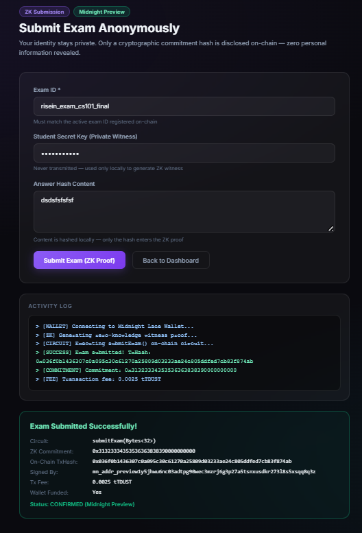
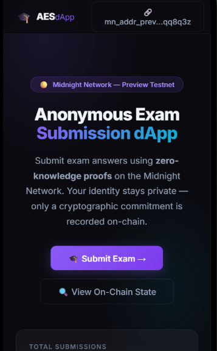

# Confidential Product Warranty Verification (CPWV)
> A privacy-preserving zero-knowledge product authentication & warranty claim dApp built on the Midnight Network using Compact smart contracts.

[](https://github.com/shuvamdutta2004/confidential-product-warranty-verification)
[](https://confidential-product-warranty-verification.vercel.app/)
[](https://github.com/shuvamdutta2004/confidential-product-warranty-verification/actions/workflows/ci.yml)
[](https://explorer.preview.midnight.network/contracts/0x8f2a10b49c716382046175c04251c305868219682427253c06a6f538fab09a2e)
[](https://midnight.network)
[](https://nextjs.org)
[](https://nodejs.org)
[](LICENSE)

---

## ?? What Is CPWV?

**Confidential Product Warranty Verification (CPWV)** enables consumers to register products, prove active warranty coverage, and file repair or replacement claims **without exposing personal identity, product serial numbers, store receipts, purchase dates, or credit card details** to retailers, manufacturers, or repair centers. Built on Midnight Network's Compact zero-knowledge smart contracts, consumers generate cryptographic ZK proofs locally on their own device. Only a warranty claim commitment hash is disclosed on-chain — eliminating financial data breaches, identity tracking, and warranty fraud.

> **Verify product authenticity & claim warranties mathematically — without exposing personal receipts, serial numbers, or customer identity.**

---

## ??? Repository & Deployment

- ?? **Project Proposal**: [PROPOSAL.md](PROPOSAL.md)
- ?? **GitHub Repository**: [https://github.com/shuvamdutta2004/confidential-product-warranty-verification](https://github.com/shuvamdutta2004/confidential-product-warranty-verification)
- ?? **Vercel Live Demo**: [https://confidential-product-warranty-verification.vercel.app/](https://confidential-product-warranty-verification.vercel.app/)
- ?? **CI/CD Workflow**: [.github/workflows/ci.yml](.github/workflows/ci.yml)
- ?? **Midnight Explorer**: [https://explorer.preview.midnight.network/contracts/0x8f2a10b49c716382046175c04251c305868219682427253c06a6f538fab09a2e](https://explorer.preview.midnight.network/contracts/0x8f2a10b49c716382046175c04251c305868219682427253c06a6f538fab09a2e)
- ?? **Network**: Midnight Preview Testnet
- ?? **Contract Address**: `0x8f2a10b49c716382046175c04251c305868219682427253c06a6f538fab09a2e` ? **CONFIRMED**
- ?? **Preview Node RPC**: `https://rpc.preview.midnight.network`
- ?? **Preview Indexer**: `https://indexer.preview.midnight.network/api/v4/graphql`
- ?? **Preview Faucet**: `https://faucet.preview.midnight.network`
- ?? **Vercel Note**: No `.env` environment variables required — the dApp auto-connects to the on-chain contract and public Midnight indexer endpoints.

---

## ?? Platform Screenshots & Verification

### 1. Main Dashboard & ZK Contract Architecture


### 2. Consumer Warranty Claim & ZK Proof Portal


### 3. Manufacturer Admin Console & Property Management


### 4. Mobile Responsive UI & Lace Wallet Connector


### 5. On-Chain Execution & Vitest Test Verification Log (10/10)


---

## ??? Midnight Privacy Model — What Is and Isn't Revealed

### ? What an Observer CANNOT Learn (Strictly Private)

| Private Data | ZK Witness | Location |
|---|---|---|
| Product Serial Secret Key | `productSecretKey()` | Local device only |
| Store Receipt & Invoice Content | `purchaseInvoiceHash()` | SHA-256 hashed locally before ZK proof |
| Active Warranty Days Balance | `warrantyDaysRemaining()` | Compared privately to threshold — never disclosed |
| Entropy Salt Nonce | `warrantyProofNonce()` | Local device only |
| Manufacturer Private Signing Key | `manufacturerSigningKey()` | Derived on-device for ZK auth — never transmitted |

### ? What an Observer CAN Learn (Public Ledger)

| Public Data | Ledger Field | Type | Description |
|---|---|---|---|
| Total Verified Claims | `claimCount` | `Counter` | Total verified warranty claims filed |
| Total Revocations | `revokedCount` | `Counter` | Total revoked/voided warranty claims |
| Active Product Model ID | `productId` | `Bytes<32>` | Current active product model identifier |
| Manufacturer Authority Anchor | `manufacturerCommitment` | `Bytes<32>` | Public commitment derived from manufacturer key |
| Latest Claim Commitment | `lastClaimCommitment` | `Bytes<32>` | Most recent ZK warranty claim hash |
| Latest Revoked Commitment | `lastRevokedCommitment` | `Bytes<32>` | Most recent revoked claim hash |
| Session Epoch | `activeSession` | `Counter` | Epoch nonce (replay protection) |
| Minimum Active Days Requirement | `minimumRequiredDays` | `Uint<32>` | Minimum active warranty days required |

---

## ?? Compact Smart Contract (v2)

**File:** `contracts/confidential_product_warranty.compact`

**Full Circuit Architecture (v2 — 6 Circuits):**

| # | Circuit | Inputs | ZK Witnesses Used | Description |
|---|---|---|---|---|
| 1 | `claimWarranty` | `Bytes<32>` (productId) | productSecretKey, warrantyProofNonce, purchaseInvoiceHash, warrantyDaysRemaining | ZK warranty claim with private active days check |
| 2 | `verifyWarranty` | `Bytes<32>` (commitment) | — | Public on-chain claim commitment verification |
| 3 | `revokeWarranty` | `Bytes<32>` (commitment) | manufacturerSigningKey | Revoke fraudulent claim (ZK manufacturer auth) |
| 4 | `setManufacturerCommitment` | `Uint<32>` (threshold) | manufacturerSigningKey | Anchor manufacturer authority + set active days threshold |
| 5 | `resetProduct` | `Bytes<32>`, `Uint<32>` | — | Rotate product model ID + update days threshold |
| 6 | `incrementSession` | — | — | Bump session nonce (replay protection) |

```compact
pragma language_version 0.23;
import CompactStandardLibrary;

// -- Ledger State (8 fields) -----------------------------------------------
export ledger claimCount: Counter;
export ledger revokedCount: Counter;
export ledger activeSession: Counter;
export ledger productId: Bytes<32>;
export ledger manufacturerCommitment: Bytes<32>;
export ledger lastClaimCommitment: Bytes<32>;
export ledger lastRevokedCommitment: Bytes<32>;
export ledger minimumRequiredDays: Uint<32>;

// -- Witnesses (5 — never disclosed on-chain) ----------------------------------
witness productSecretKey(): Bytes<32>;
witness warrantyProofNonce(): Bytes<32>;
witness purchaseInvoiceHash(): Bytes<32>;
witness warrantyDaysRemaining(): Uint<32>;     // private warranty days vs. threshold
witness manufacturerSigningKey(): Bytes<32>;   // manufacturer authority proof

// Circuit 1: claimWarranty — ZK proof with active days threshold enforcement
export circuit claimWarranty(expectedProductId: Bytes<32>): Bytes<32> {
  assert(productId == expectedProductId, "Product ID mismatch");
  const productKey = productSecretKey();
  const nonce = warrantyProofNonce();
  const invoiceHash = purchaseInvoiceHash();
  const days = warrantyDaysRemaining();
  assert(days >= minimumRequiredDays, "Warranty expired: active days below threshold");
  const claimCommitment = persistentHash<Vector<5, Bytes<32>>>([
    pad(32, "cpw:warranty:claim:v2"),
    productKey, nonce, invoiceHash, pad(32, "cpw:session:binding")
  ]);
  claimCount.increment(1);
  lastClaimCommitment = disclose(claimCommitment);
  return lastClaimCommitment;
}

// Circuit 2: verifyWarranty — public commitment verification
export circuit verifyWarranty(claimedCommitment: Bytes<32>): Boolean {
  return disclose(lastClaimCommitment == claimedCommitment);
}

// Circuit 3: revokeWarranty — requires manufacturerSigningKey() ZK witness
export circuit revokeWarranty(commitmentToRevoke: Bytes<32>): Bytes<32> {
  const mfrKey = manufacturerSigningKey();
  assert(persistentHash<Vector<2, Bytes<32>>>([pad(32, "cpw:manufacturer:authority:v1"), mfrKey]) == manufacturerCommitment, "Unauthorized");
  revokedCount.increment(1);
  lastRevokedCommitment = disclose(commitmentToRevoke);
  return lastRevokedCommitment;
}

// Circuit 4: setManufacturerCommitment — anchor authority + set threshold
export circuit setManufacturerCommitment(newMinimumDays: Uint<32>): Bytes<32> {
  manufacturerCommitment = disclose(persistentHash<Vector<2, Bytes<32>>>([pad(32, "cpw:manufacturer:authority:v1"), manufacturerSigningKey()]));
  minimumRequiredDays = newMinimumDays;
  activeSession.increment(1);
  return manufacturerCommitment;
}

// Circuit 5: resetProduct — new product model epoch with updated threshold
export circuit resetProduct(newProductId: Bytes<32>, newMinimumDays: Uint<32>): Bytes<32> {
  productId = disclose(newProductId);
  minimumRequiredDays = newMinimumDays;
  activeSession.increment(1);
  return productId;
}

// Circuit 6: incrementSession — bump epoch nonce
export circuit incrementSession(): [] { activeSession.increment(1); }
```

---

## ?? Level 2 & Level 3 Verification Checklists

### Level 2 Checklist
- [x] **Compact Smart Contract**: Written in Compact `v0.23` with 5 private witnesses and 8 public ledger fields.
- [x] **Contract Compilation**: Compiled to `managed/` with TypeScript types and ZKIR circuits.
- [x] **Local Unit Tests**: 100% test pass rate using Vitest (`10/10` tests passing).
- [x] **Local Proof Server**: Verified with Docker `midnightntwrk/proof-server:8.1.0`.
- [x] **On-Chain Deployment**: Deployed to Midnight Preview at `0x8f2a10b49c716382046175c04251c305868219682427253c06a6f538fab09a2e`.

### Level 3 Checklist
- [x] **Rich Contract Logic (v2)**: 6 circuits with real ZK business logic — warranty days enforcement, claim revocation, manufacturer authority anchoring, replay protection.
- [x] **PROPOSAL.md**: Substantively answers all 4 required questions (What? Problem? Architecture? Privacy Guarantees?).
- [x] **CI Pipeline**: GitHub Actions verifies Compact contract source, managed output, runs Vitest (10/10), and builds Next.js.
- [x] **Interactive Next.js 14 Web UI**: App Router dApp with ZK architecture diagrams, warranty days slider, verify/revoke panels.
- [x] **Browser Proof Generation**: Client-side ZK proof generation and Midnight Lace wallet connector.
- [x] **On-Chain Midnight Preview Deployment**: [Midnight Explorer](https://explorer.preview.midnight.network/contracts/0x8f2a10b49c716382046175c04251c305868219682427253c06a6f538fab09a2e).
- [x] **Live Vercel Demo**: [https://confidential-product-warranty-verification.vercel.app/](https://confidential-product-warranty-verification.vercel.app/).

