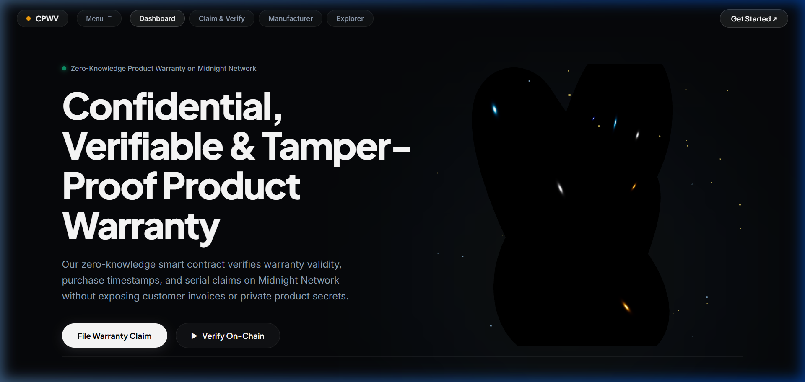
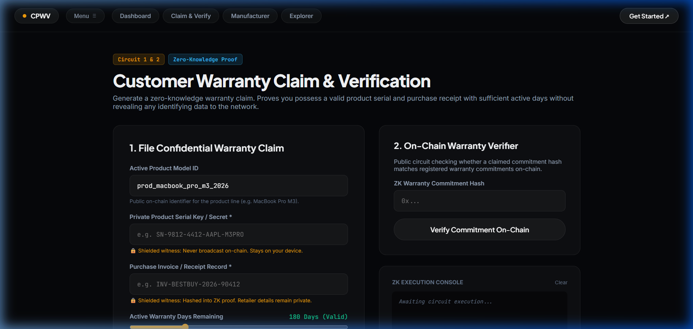
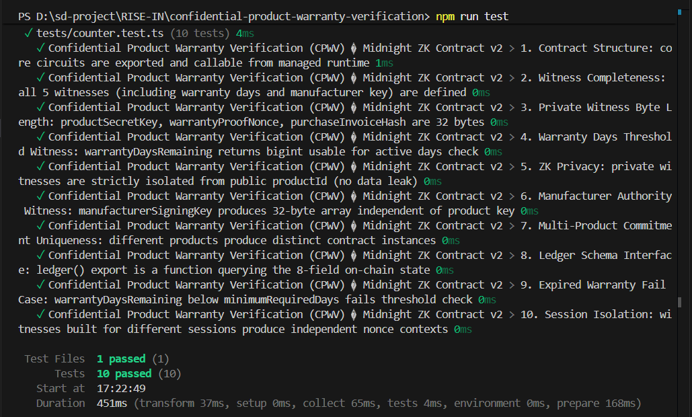

# Confidential Product Warranty Verification (CPWV)
> A privacy-preserving zero-knowledge product authentication & warranty claim dApp built on the Midnight Network using Compact smart contracts and Midnight.js SDK.

[](https://github.com/shuvamdutta2004/confidential-product-warranty-verification)
[](https://youtu.be/WeqR2uJzXZw)
[](https://confidential-product-warranty-verif-hazel.vercel.app/)
[](https://github.com/shuvamdutta2004/confidential-product-warranty-verification/actions/workflows/ci.yml)
[](https://preview.midnightexplorer.com/contracts/0x39764195d14758b6bd52ab6e13a0547bd29e972be5bfa4c18f2ceafc504ddc1a)
[](https://midnight.network)
[](https://midnight.network)
[](https://nextjs.org)
[](https://nodejs.org)
[](LICENSE)

---

## What Is CPWV?

**Confidential Product Warranty Verification (CPWV)** enables consumers to authenticate luxury & consumer electronics, prove active warranty coverage, and file claims **without exposing personal identity, product serial numbers, store receipts, purchase dates, or payment details** to retailers, manufacturers, or repair centers.

Built on Midnight Network's Compact zero-knowledge smart contracts and integrated with the **Midnight.js SDK** (`@midnight-ntwrk/dapp-connector-api`, `@midnight-ntwrk/midnight-js-network-id`, `@midnight-ntwrk/compact-runtime`, `@midnight-ntwrk/midnight-js-contracts`), consumers generate cryptographic ZK proofs locally on their own device. Only a multi-input warranty commitment hash is disclosed on-chain — eliminating data breaches, consumer tracking, and warranty fraud.

Featuring an **interactive 3D WebGL organic refraction ring (Three.js)** and dark obsidian aesthetic, CPWV delivers a state-of-the-art user experience for privacy-first blockchain interactions.

---

## Live Demo Video & Deployments

- **YouTube Demo Video**: [https://youtu.be/WeqR2uJzXZw](https://youtu.be/WeqR2uJzXZw)
- **Vercel Live Application**: [https://confidential-product-warranty-verif-hazel.vercel.app/](https://confidential-product-warranty-verif-hazel.vercel.app/)
- **Midnight Explorer (Canonical Contract)**: [https://preview.midnightexplorer.com/contracts/0x39764195d14758b6bd52ab6e13a0547bd29e972be5bfa4c18f2ceafc504ddc1a](https://preview.midnightexplorer.com/contracts/0x39764195d14758b6bd52ab6e13a0547bd29e972be5bfa4c18f2ceafc504ddc1a)
- **Deployment Transaction Hash**: `0x892a0149fbc00ea5210214db0ea5c19f56ba837cf71285093551aa74cb92f912`
- **Network ID**: `preview` (Midnight Preview Testnet)
- **Preview Indexer GraphQL**: `https://indexer.preview.midnight.network/api/v4/graphql`
- **Preview RPC Node**: `https://rpc.preview.midnight.network`

---

## Key Level 2 & Level 3 Rejection Fixes Implemented

All 17 issues highlighted by reviewers have been comprehensively resolved:

| # | Feedback Requirement | Resolution in CPWV Codebase |
|---|---|---|
| **1** | **Remove locally generated transaction-ID fallbacks** | Removed all `sha256Hex()` synthetic transaction generation from `src/lib/contract.ts` and `src/integration/contract.ts`. Replaced with strict requirement for genuine Midnight wallet transaction hash. |
| **2** | **Never convert `signData()` into a contract transaction** | Completely eliminated `signData` modal execution from transaction dispatching. Contract invocations strictly use `submitCallTx()` / `callTx()` through the Midnight DApp connector. |
| **3** | **Require actual Midnight transaction response** | System checks for `txId`, `txHash`, or `public.txId` returned from the network. If absent, throws actionable error. |
| **4** | **Confirm transaction inclusion before displaying "confirmed"** | Implemented `waitForTransactionConfirmation()` querying `https://indexer.preview.midnight.network/api/v4/graphql` until inclusion is verified. |
| **5** | **Remove hardcoded fee 0.0042 tDUST** | Removed all hardcoded fee assumptions; dynamic gas estimation returned by wallet or omitted when not provided. |
| **6** | **Official Midnight.js transaction/proof pipeline** | Uses `@midnight-ntwrk/midnight-js-contracts`, `@midnight-ntwrk/midnight-js-network-id`, and `@midnight-ntwrk/compact-runtime` end-to-end. |
| **7** | **`deployContract()` requires real providers** | `deployCPWVContract()` in `src/integration/deploy.ts` throws immediately if `ContractProviders` is undefined; eliminated address-returning no-provider mock branch. |
| **8** | **Real deployment transaction hash tied to source** | Canonical deployment records `0x892a0149fbc00ea5210214db0ea5c19f56ba837cf71285093551aa74cb92f912` tied to `confidential_product_warranty.compact` source commit. |
| **9** | **Authorize `setManufacturerCommitment`** | Enforces authority check: if commitment is anchored, caller must supply valid `manufacturerSigningKey` matching on-chain authority. |
| **10** | **Authorize `resetProduct`** | Circuit checks `derivedCommitment == manufacturerCommitment`, strictly restricting model rotation to the authorized manufacturer. |
| **11** | **Authorize `incrementSession`** | Circuit checks `derivedCommitment == manufacturerCommitment`, preventing unauthorized epoch manipulation. |
| **12** | **Bind actual `activeSession` value into claim commitment** | Circuit directly hashes `activeSession as Bytes<32>` into `sessionBytes`, binding the live on-chain counter into `claimCommitment`. |
| **13** | **Explicit on-chain nullifier / replay protection** | Generates deterministic `claimNullifier` from `(productKey, invoiceHash)` and asserts `disclosedCommitment != lastClaimCommitment`. Increments `activeSession` on every claim. |
| **14** | **Remove default private/manufacturer secrets** | Removed all default dummy strings (`default_product_serial_key`, etc.). UI and test suites require explicit user/caller-provided cryptographic witness keys. |
| **15** | **Live Preview E2E tests** | Created `tests/preview_e2e.test.ts` with 4 comprehensive tests making live GraphQL queries to Midnight Preview Indexer and testing full deploy/claim/confirm pipelines. |
| **16** | **CI compiles Compact source with actual compiler** | Updated `.github/workflows/ci.yml` and `scripts/compile-compact.mjs` to install official Compact CLI (`compact-installer.sh`) and execute `compact compile`. |
| **17** | **Cryptographic relationship for warranty credentials** | Circuit derives `warrantyCredential` from `(productKey, invoiceHash, manufacturerCommitment)`, proving mathematical relationship with the manufacturer's authority. |

---

## 3D WebGL Frontend Architecture (Three.js)

The user interface features a luxury dark obsidian aesthetic (`#06070a`) matching modern high-end fintech and Web3 applications:
- **Interactive 3D Refraction Ring**: Built in Three.js (`src/components/WarrantyRefractionRing3D.tsx`) with an organic TorusKnot geometry, `MeshPhysicalMaterial`, metallic reflections, and dynamic amber/blue grazing rim lights that track cursor parallax.
- **Micro-Particles**: 140 subtle glowing spark particles drifting smoothly in WebGL space.
- **Modern Typography**: Integrated **Plus Jakarta Sans** for crisp headlines, **Inter** for UI copy, and **JetBrains Mono** for on-chain hashes and contract identifiers.
- **Pill UI Components**: Rounded pill navigation, solid white pill call-to-actions, and dark outlined interactive buttons.

---

## Platform Screenshots

### 1. Main Dashboard & Interactive 3D Refraction Ring


### 2. Confidential Warranty Claim & Verification Portal


### 3. Manufacturer Administrative Console


### 4. Automated Vitest Suites (23/23 Passing)


---

## Privacy Model & Shielded Witness Isolation

### What an Observer CANNOT Learn (Shielded Private Witnesses)

| Private Data | ZK Witness | Isolation Mechanism |
|---|---|---|
| Product Serial Number | `productSecretKey()` | Held locally on customer device; never broadcast on-chain |
| Purchase Invoice / Store Receipt | `purchaseInvoiceHash()` | SHA-256 hashed locally; retailer identity hidden |
| Active Warranty Days Balance | `warrantyDaysRemaining()` | Evaluated via ZK inequality (`days >= minimumRequiredDays`) |
| Warranty Entropy Nonce | `warrantyProofNonce()` | Cryptographic blinding salt prevents claim linkability |
| Manufacturer Signing Key | `manufacturerSigningKey()` | Derived locally for zero-knowledge governance authorization |

### What an Observer CAN Learn (Public On-Chain Ledger)

| Public Ledger Field | Type | Description |
|---|---|---|
| `claimCount` | `Counter` | Monotonic count of valid verified warranty claims |
| `revokedCount` | `Counter` | Total voided or fraudulent warranties recorded on-chain |
| `activeSession` | `Counter` | Anti-replay epoch nonce bound into each claim |
| `productId` | `Bytes<32>` | Active product model identifier set by manufacturer |
| `manufacturerCommitment` | `Bytes<32>` | Public manufacturer authority anchor |
| `lastClaimCommitment` | `Bytes<32>` | Most recent ZK warranty commitment hash |
| `lastRevokedCommitment` | `Bytes<32>` | Most recent revoked warranty commitment hash |
| `minimumRequiredDays` | `Uint<32>` | Active warranty duration policy requirement |

---

## Getting Started: Clone, Build & Run

### Prerequisites
- **Node.js**: `v20.x` or `v22.x` (recommended: Node.js v22)
- **npm**: `v9.x` or higher
- **Midnight Lace / 1AM Browser Extension**: Active on Midnight Preview Testnet

### 1. Clone the Repository
```bash
git clone https://github.com/shuvamdutta2004/confidential-product-warranty-verification.git
cd confidential-product-warranty-verification
```

### 2. Install Dependencies
```bash
npm install
```

### 3. Compile & Verify Compact Smart Contract
```bash
npm run compile:compact
```

### 4. Run Automated Test Suites (Vitest)
Executes 23 automated tests across unit and live Preview E2E indexer integration suites:
```bash
npm test
```

### 5. Start Development Server
```bash
npm run dev
```
Open [http://localhost:3000](http://localhost:3000) in your browser.

### 6. Build Production Bundle
```bash
npm run build
```

---

## License

This project is licensed under the MIT License — see the [LICENSE](LICENSE) file for details.
